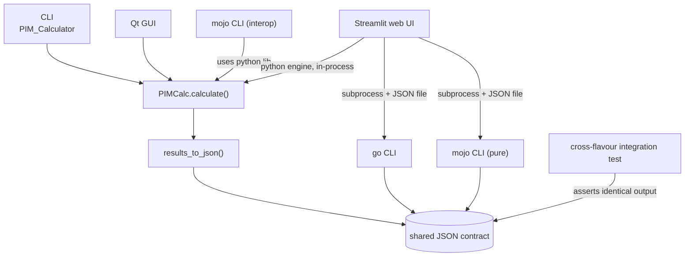

# PIM Calculator

Passive Intermodulation calculator for RF antenna systems. Computes IM3/IM5
mixing products of multiple TX carriers, including their occupied bandwidth,
and checks whether they land inside an RX band (FDD uplink desense).
Implemented in three interchangeable flavours that are kept in lockstep by a
cross-flavour integration test in CI.

[](https://github.com/panjacek/PIM_Calculator/actions/workflows/ci.yml)
[](LICENSE)
[](python/pyproject.toml)
[](go/go.mod)
[](pyproject.toml)

## What is PIM?

[Passive Intermodulation](https://en.wikipedia.org/wiki/Passive_intermodulation):
unwanted mixing products created when multiple strong TX carriers pass through
a non-linear passive component (antenna, connector). Details and formulas:
[`docs/pim.md`](docs/pim.md).

## Flavours

Each flavour is a self-contained implementation of the same calculator —
pick whichever fits your environment; you do **not** need all of them.

| flavour | directory | description | requires |
| ------- | --------- | ----------- | -------- |
| Python  | `python/` | Reference implementation: PIMCalc class, CLI, Qt GUI, pytest suite | [uv](https://docs.astral.sh/uv/) only (Python >= 3.12) |
| Go      | `go/`     | Standalone CLI port, no external dependencies | Go >= 1.25 |
| Mojo    | `mojo/`   | Pure native port plus a wrapper around the Python library via CPython interop | [uv](https://docs.astral.sh/uv/) only (Mojo toolchain comes with the root dev env) |

CI keeps all flavours in lockstep via a cross-flavour integration test, but
locally nothing forces you to build more than one: no Go on your host simply
means you skip the `go/` flavour and its make targets.

## Design decisions

- **Three flavours, one algorithm.** Each directory implements the same
  PIM maths against the same CLI contract, so you can run whichever runtime
  your environment already has. Python is the reference, Go is a standalone
  binary with zero deps, Mojo compiles to a native binary.
- **Shared JSON contract.** Every flavour serialises results to the same
  JSON shape (`tx_list`, `rx_list`, `IM3`, `IM5` rows of `cf`/`min`/`max`).
  It is the language-agnostic seam: the web UI drives all four engines
  (python, go, mojo, mojo_py) through it without knowing any of their code.
- **Cross-flavour integration test as drift guard.** CI runs all four CLIs
  on one canonical case and fails if centres, row values or row counts
  disagree. Port changes cannot silently diverge.
- **Mojo twice over.** `mojo/` holds a pure native port (fast, no python at
  runtime) and a CPython-interop wrapper around the python library, proving
  the same logic works natively and through interop.

## Architecture



## Quick start

Install [uv](https://docs.astral.sh/uv/) first, it fetches the pinned Python
version and every toolchain used below:

```bash
curl -LsSf https://astral.sh/uv/install.sh | sh
```

Then:

```bash
uv sync --group dev --group web          # root env: python package + mojo toolchain + web deps
make run-python-cli CALC_ARGS="2152,1932 -r 1752,1900"
make run-mojo-cli CALC_ARGS="2152,1932 -r 1752,1900"   # pure mojo binary
```

Go flavour (only if you want it):

```bash
make run-go-cli CALC_ARGS="-rx_list 1752,1900 -rx_band 5,5 -tx_band 5,5 2152,1932"   # builds dist/pim_calc-go first
```

Notes: Python >= 3.14 is pinned via `.python-version` and fetched
automatically by uv. `make test` / `make lint` / `make test-integration`
span every flavour and therefore need all toolchains installed.

## CLI usage

Same arguments for the python and mojo flavours:

```
PIM_Calculator [-h] [--tx_size TX_SIZE] [-r RX_LIST] [--rx_size RX_SIZE]
                [--output_file OUTPUT_FILE] [--log_lvl LOG_LVL]
                tx_list
```

| argument | description |
| -------- | ----------- |
| tx_list (positional) | List of TX carriers, e.g. `2152,1932` |
| --tx_size TX_SIZE | TX carrier bandwidths in MHz [5 per carrier] |
| -r RX_LIST, --rx_list RX_LIST | List of RX carriers |
| --rx_size RX_SIZE | RX carrier bandwidths in MHz [5 per carrier] |
| --output_file PATH | Write results as JSON (schema below) |
| --log_lvl LOG_LVL | logger level to display [INFO] |

The go flavour uses flags instead:
`dist/pim_calc-go -tx_band "5,5" -rx_list "1752,1900" -rx_band "5,5" 2152,1932`
(band lists are always explicit there — no auto-expansion).

JSON output (identical schema in all flavours), for the case
`2152,1932 -r 1752,1900`:

```json
{
  "tx_list": [2152.0, 1932.0],
  "rx_list": [1752.0, 1900.0],
  "IM3": [
    {"cf": 1712.0, "min": 1704.5, "max": 1719.5},
    {"cf": 1932.0, "min": 1924.5, "max": 1939.5},
    {"cf": 2152.0, "min": 2144.5, "max": 2159.5},
    {"cf": 2372.0, "min": 2364.5, "max": 2379.5}
  ],
  "IM5": [
    {"cf": 1492.0, "min": 1479.5, "max": 1504.5},
    {"cf": 1712.0, "min": 1699.5, "max": 1724.5}
  ]
}
```

IM5 is truncated above: this case really emits 10 IM5 rows, duplicates stay
in when the same centre frequency comes from different TX source pairs.

## Example output

`make run-python-cli CALC_ARGS="2152,1932 -r 1752,1900"` prints the IM3
table below (log header and the IM5 table omitted here), followed by the
RX check verdict:

```
================================================
PIM Cf | f min  | f max  | TX source
1492.0 | 1479.5 | 1504.5 | [1932. 1932. 1932. 2152. 2152.]
1712.0 | 1699.5 | 1724.5 | [1932. 1932. 1932. 2152. 1932.]
1712.0 | 1699.5 | 1724.5 | [2152. 1932. 1932. 2152. 2152.]
1932.0 | 1919.5 | 1944.5 | [2152. 1932. 1932. 2152. 1932.]
1932.0 | 1919.5 | 1944.5 | [2152. 2152. 1932. 2152. 2152.]
2152.0 | 2139.5 | 2164.5 | [2152. 1932. 1932. 1932. 1932.]
2152.0 | 2139.5 | 2164.5 | [2152. 2152. 1932. 2152. 1932.]
2372.0 | 2359.5 | 2384.5 | [2152. 2152. 1932. 1932. 1932.]
2372.0 | 2359.5 | 2384.5 | [2152. 2152. 2152. 1932. 1932.]
2592.0 | 2579.5 | 2604.5 | [2152. 2152. 2152. 1932. 1932.]
================================================
==== RX check ===
===== IM3 RX =====
no hits
===== IM5 RX =====
no hits
```

When an RX carrier does collide, each hit line names the RX range, the
offending PIM product and its TX source:

```
==== RX check ===
===== IM3 RX =====
1709.5-1714.5 is inside: 1704.5-1719.5, TX src: [1932. 1932. 2152.]
```

## GUI (optional)

The Qt GUI is an extra, the CLI and library work without it:

```bash
uv sync --project python --extra gui    # pulls PySide6, scipy, matplotlib
make run-python-gui                     # launch the GUI
```

The core package needs only numpy, the GUI pulls the `gui` extra.

## Web UI

A Streamlit app drives the calculator through the shared JSON contract:
engine selection (`python` / `go` / `mojo` / `mojo_py`), editable TX/RX
carrier tables, IM3/IM5 tables with RX-hit flags, and a frequency chart.

```bash
uv sync --group dev --group web        # root env incl. web deps
make run-web                           # launch http://localhost:8501
make test-web                          # unit + playwright e2e (chromium lands in ~/.cache)
```

The python engine always works; go/mojo engines need their binary/toolchain
and are shown with a hint (and skipped) when unavailable.

## Docker (optional)

Two images built from `python/Dockerfile` through `docker-compose.yml`
(python flavour only):

```bash
docker compose build cli                                       # CLI image
docker compose run --rm cli PIM_Calculator 2152,1932 -r 1752,1900
docker compose up gui                                          # Qt GUI (X socket + /dev/dri)
```

The GUI container needs your X server exported and permitted:
`export DISPLAY=:0 && xhost +local:docker` before `up gui`.

## Make targets

Run `make help` for the full annotated list. The essentials:

- `make test` - all suites: unit (python/go/mojo) + integration + perf
- `make test-unit` - unit suites only, fast loop
- `make test-perf` - performance benchmarks (`pytest-benchmark`; SVG
  histograms + JSON report land in `python/.benchmarks/`)
- `make lint` / `make format` - linters / auto-format for all flavours
  (python side: ruff + mypy + bandit)
- `make sync` - upgrade dep versions & re-lock/re-sync all flavours
  (root uv env, python/, go/)
- `make test-integration` - cross-flavour comparison (see [`docs/ci.md`](docs/ci.md))
- `make run-python-cli CALC_ARGS="..."`, `make run-go-cli`,
  `make run-mojo-cli CALC_ARGS="..."` (pure Mojo, compiles a native binary
  first; `run-mojo-py-cli` for the python-interop wrapper) - the CLIs
- `make run-web` - launch the streamlit web UI (all flavours via the shared
  JSON contract); `make test-web` - its unit + playwright e2e tests
  (first run auto-downloads chromium into `~/.cache`, no sudo)
- `make build` - build all packages: go/mojo CLI binaries + python wheel/sdist
  (`make build-go`, `make build-mojo`, `make build-python` for individual
  flavours), `make install`, `make clean`

## Development environment

Root `pyproject.toml` defines a uv-managed dev environment with the Mojo
toolchain, the editable `pim-calculator` package, pytest and ruff (plus the
`web` group for the streamlit UI):

```bash
uv sync --group dev --group web
```

Mojo toolchain: https://mojolang.org/install/ (installed as the pinned
`mojo==1.0.0` dependency of the root project).

## Documentation

- [`docs/pim.md`](docs/pim.md) - what PIM is, which products are computed,
  how RX hit checks work
- [`docs/ci.md`](docs/ci.md) - CI pipeline: job graph, integration test case,
  local reproduction
- [`docs/versioning.md`](docs/versioning.md) - semver strategy exploration
  for the three flavours
