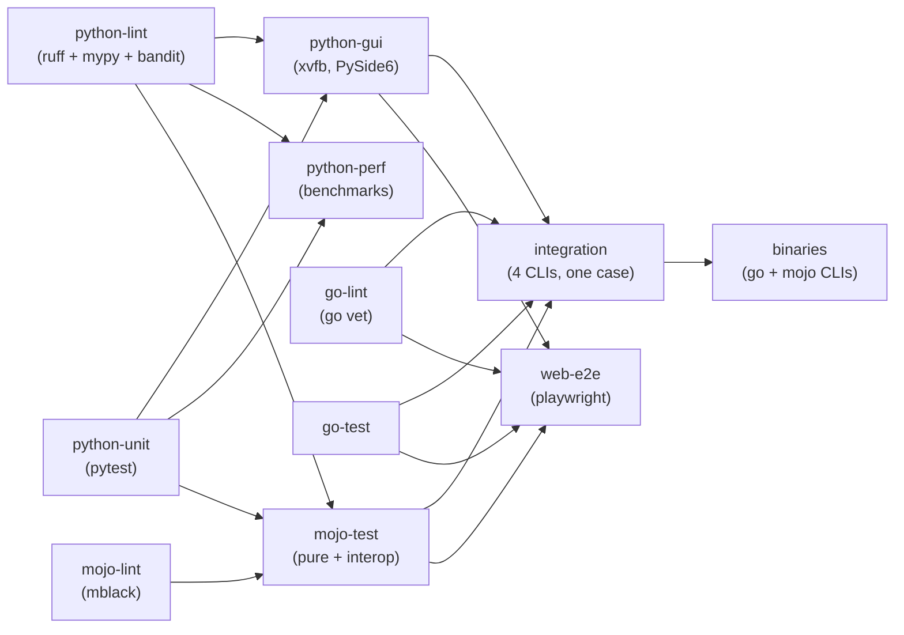

# CI Pipeline

Single workflow: `.github/workflows/ci.yml`. Triggers: push to `main`, PRs to
`main`, manual dispatch. Stale runs on the same ref are cancelled.

## Job graph



- `python-lint`, `python-unit`, `go-lint`, `go-test`, `mojo-lint` start
  immediately and run in parallel.
- `mojo-lint` feeds `mojo-unit`: unit tests only run on lint-clean mojo code.
  `mojo-test` additionally waits for the python flavour to be lint-clean and
  unit-green first (mojo wraps the python library).
- `python-gui` waits for the python flavour too (GUI tests are slow).
- `python-perf` runs parallel to the other flavours: benchmarks only need the
  python lib, no timing gates. Gated on `python-lint` + `python-unit`.
- `web-e2e` runs parallel to `integration`: same gate (all flavour lints+units
  green), builds its own go CLI so all four web engines execute under
  playwright. `binaries` does not wait for it.
- `integration` needs all flavour jobs green (`python-perf` runs independently).
- `binaries` runs last: once everything is green (integration included) it
  runs `make build`, which lands all artifacts in the shared `dist/` directory
  (`pim_calc-go`, `pim_calc-mojo-pure`, wheel + sdist), and uploads them as
  the `packages-linux-amd64` run artifact (14-day retention — temp storage;
  a future tag-driven workflow will turn these into a proper GitHub Release /
  PyPI upload). It is also the only CI job that compiles the pure mojo CLI.

## Jobs

| Job         | What it does                                              |
|-------------|-----------------------------------------------------------|
| python-lint | `make lint-python` (ruff+mypy+bandit) + `make lint-tests` (ruff+mypy) |
| python-unit | `make test-python-unit` (pytest, GUI tests excluded)      |
| python-gui  | `xvfb-run make test-python-gui` (PySide6 under Xvfb)      |
| python-perf | `make test-perf` (pytest-benchmark; uploads SVG/JSON artifacts) |
| go-lint     | `make lint-go` (`go vet`)                                 |
| go-test     | `make test-go`                                            |
| mojo-lint   | `make lint-mojo` (mblack)                                 |
| mojo-test   | `make test-mojo` (Mojo TestSuite, pure + CPython interop) |
| integration | see below                                                 |
| web-e2e     | `make test-web` (streamlit unit + playwright e2e; chromium install + `make build-go` in-job) |
| binaries    | `make build` (go/mojo CLIs + python wheel/sdist); stages and uploads the `packages-linux-amd64` artifact, 14-day retention |

### Integration job

Runs all three CLIs on one canonical case:

```
TX = 2152,1932   RX = 1752,1900   bands default (5 MHz)
```

Each CLI writes its results via `--output_file` as JSON (shared schema,
see `python/PIM_Calculator/pim_calc.py::results_to_json`):

```json
{
  "tx_list": [2152.0, 1932.0],
  "rx_list": [1752.0, 1900.0],
  "IM3": [{"cf": 1712.0, "min": 1704.5, "max": 1719.5}],
  "IM5": [{"cf": 1492.0, "min": 1479.5, "max": 1504.5}]
}
```

The test (`tests/test_integration.py`, plain pytest) then asserts:

1. each flavour's IM centre-frequency set equals the known truth for this
   case: `{1492, 1712, 1932, 2152, 2372, 2592}` MHz
   (IM3 set plus IM5-only values), and
2. all three flavours agree with each other.

This catches missing values *and* spurious extras — any computation drift
between flavours fails with the exact diff.

## Local reproduction

Everything CI runs is a Makefile target:

```bash
uv sync --group dev                        # root env: mojo toolchain + editable pim-calculator + pytest/ruff
uv sync --project python --group dev       # python env (add --extra gui for GUI)
make lint                  # python: ruff+mypy+bandit, tests: ruff+mypy,
                           # mojo: mblack, go: go vet
make test-python-unit      # fast unit tests
make test-python-gui       # GUI tests (needs a display or xvfb-run)
make test-perf             # performance benchmarks (histograms + JSON in python/.benchmarks/)
make test-go
make test-mojo

# web UI (unit + playwright e2e) — self-contained, downloads
# chromium into ~/.cache on first run:
make test-web
```

Integration case by hand:

```bash
make build-go
( cd python && uv run --project . PIM_Calculator 2152,1932 --rx_list=1752,1900 )
./dist/pim_calc-go -tx_band "5,5" -rx_list "1752,1900" -rx_band "5,5" 2152,1932
( cd mojo && uv run mojo run -I . pim_calc_py.mojo 2152,1932 -r 1752,1900 )
( cd mojo && uv run mojo run -I . cli.mojo 2152,1932 -r 1752,1900 )
```

Note the go CLI requires every band list explicitly (`-tx_band`, `-rx_band`);
the python/mojo CLIs auto-expand a missing band default to 5 MHz per carrier.
The mojo directory has two flavours: `pim_calc_py.mojo` is the CPython-interop
wrapper around the python library; `cli.mojo` (+ `pim_calc.mojo`) is the pure
native port with zero Python imports.

Or just run the whole comparison as CI does:

```bash
make test-integration
```

## Environment notes

- Python is pinned to **3.14** via root `.python-version`; uv honours it both
  locally and in CI (downloads a managed interpreter if the runner lacks one).
- Root `pyproject.toml` pins the Mojo toolchain (`mojo==1.0.0`) and installs
  `pim-calculator` editable from `python/` — this is what the mojo jobs use.
- `python/` has its own lockfile; CI syncs it per job with uv caching.
- Coverage: the python unit job emits `coverage.xml` (uploaded as the
  `coverage-python` artifact); go prints per-package `go test -cover`
  summaries. Mojo's TestSuite has no coverage tooling.
- Go version comes from `go/go.mod` via `setup-go`.
- GUI job installs the same X/GL system packages as `python/Dockerfile`
  (gui stage), including `libegl1`/`libgl1` required by PySide6.
